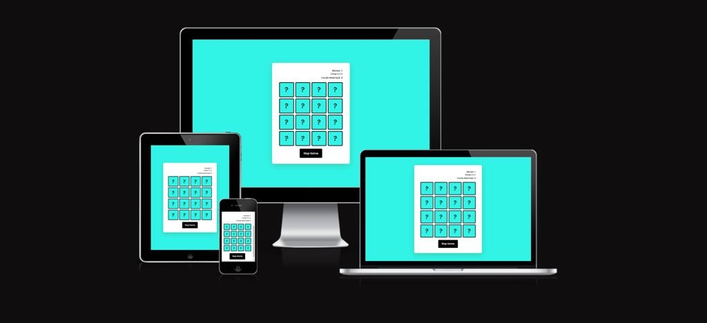
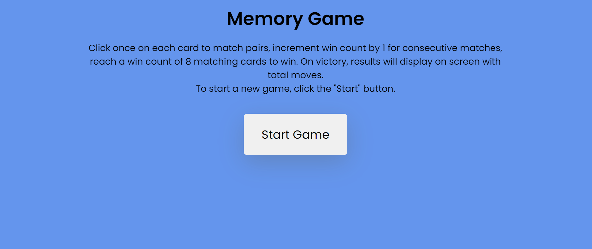
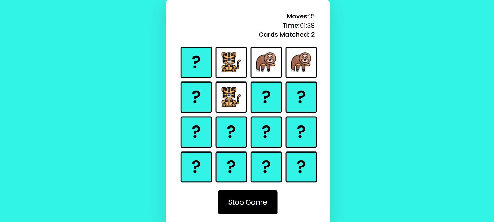
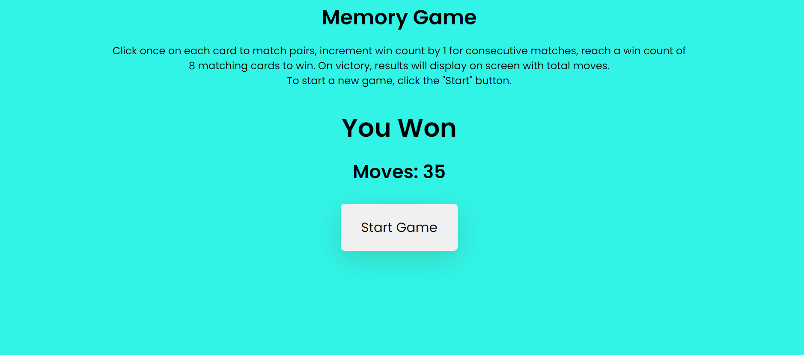
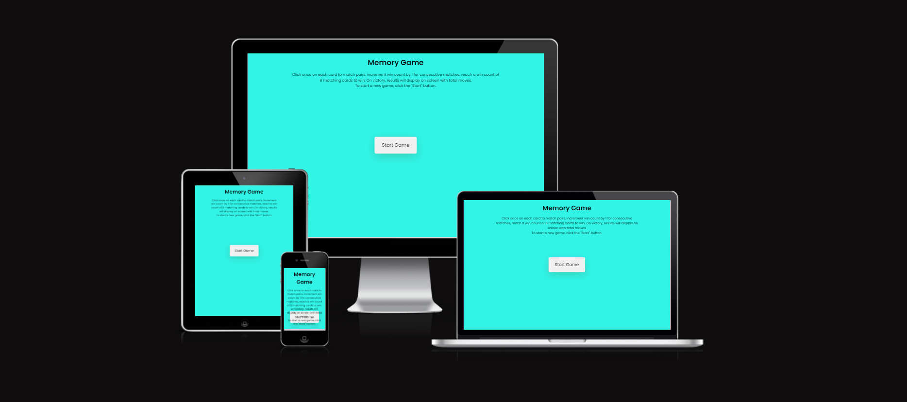
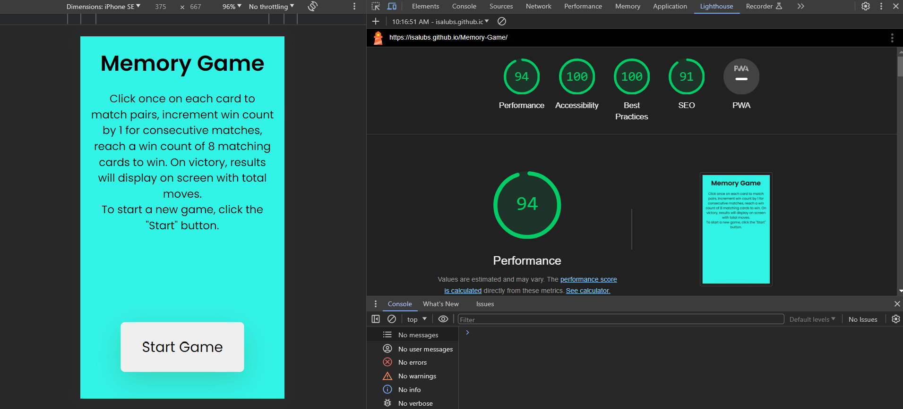
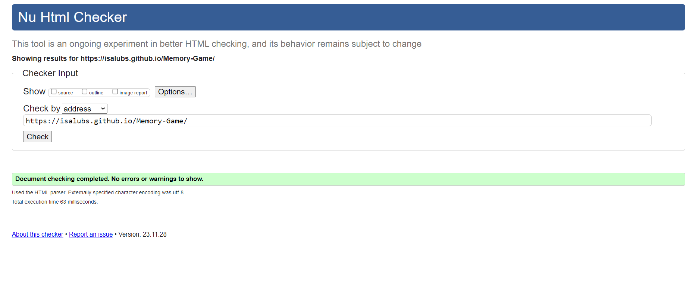
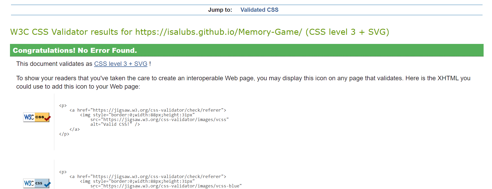
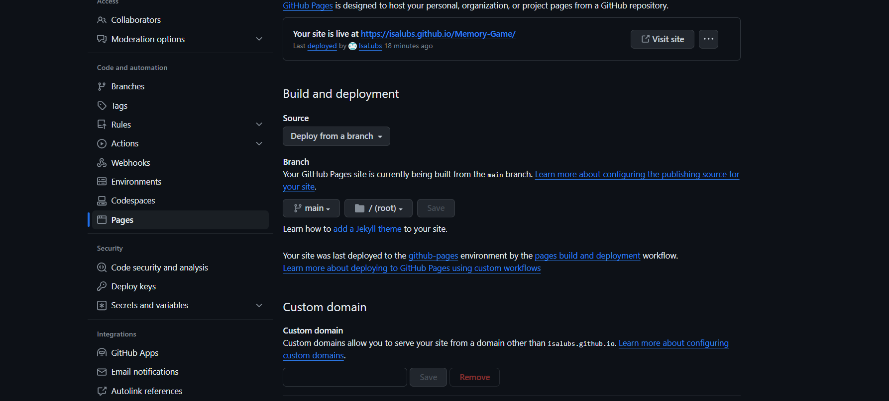

# Memory Game

[Visit the website here](https://isalubs.github.io/Memory-Game/)

Memory Game is a fully responsive website designed to captivate and entertain users while simultaneously providing a platform for enhancing their cognitive abilities. Tailored for individuals seeking a fun and interactive way to boost memory skills, this website offers a dynamic and visually appealing memory game experience.

Upon entering the site, users are greeted with an intuitive interface that promotes ease of navigation. The well-crafted design invites players to immerse themselves in a stimulating challenge that combines entertainment with cognitive development. The user-friendly layout ensures a seamless experience for players of all ages and backgrounds.

The core feature of the website is the memory game itself, a thoughtfully crafted activity that prompts users to match pairs of images within a specified time frame. As players progress through different levels, the complexity of the game increases, providing a progressive and rewarding journey. The game not only entertains but also serves as a valuable tool for honing memory retention and concentration skills.

In addition to its entertainment value, the website fosters a sense of achievement through scoring mechanisms and level progression. Users, regardless of age, can track their performance, encouraging friendly competition or personal improvement goals.
Moreover, Memory Game incorporates responsive design elements, making it accessible across various devices, including desktops, tablets, and smartphones. This adaptability ensures that users can enjoy the game seamlessly, regardless of their preferred device.

# Features

This is a fully responsive website that was designed with a mobile-first approach as this is the most likely way it will be viewed, the game is divided in different sections as listed below.Memory Game stands as a testament to the fusion of entertainment and cognitive enhancement. With its thoughtful design, engaging gameplay, and user-friendly interface, this website strives to create an enjoyable and enriching experience for individuals seeking both amusement and mental stimulation.

## User-Friendly Interface.

- As a first-time user,l want to find the interface thoughtfully designed for easy navigation.
- As a first time user i want see Clear instructions on how to play the game.
  

## Start Button

- As a first-time user, I want to explore the "Start" button, which serves as a gateway to a dedicated section providing detailed functionality about the game.
- As a first time User i also want to click on start button to start a new game as instructed in the decsription.
  

## Stop Button

- The stop button is applied to the Meomory Game for the user's to stop the game when intterupted while playing, to start afresh.
  

## The Game Area

- As a first-time user, you'll likely be drawn to the central element of the website—the game area. Here, you can engage with a grid of face-down cards, each holding a hidden content. To reveal the information on each card, simply click on them once while playing.
  

## Timer Display

- As a participant engaging in the Memory game challenge for the first time, I desire a clear and conspicuous presentation of essential information during gameplay. Specifically, I would like real-time updates on the clock, the number of card matches achieved, and the total moves made. These crucial elements should be prominently displayed throughout the gaming experience, ensuring that I can effortlessly track my progress.
  

## Score Display

- As a first-time user, you'll want to know that the Memory Game is designed to provide real-time feedback on your progress. Upon successfully matching all pairs in the game, the system will display a celebratory "YOU WON" message. Additionally, the total number of moves you made throughout the game will be updated and presented in real-time. This feature not only acknowledges your achievement but also keeps you informed about your performance, creating an engaging and rewarding experience. It's a way to celebrate your success while offering a transparent view of your gameplay metrics.
  

## Testing

### **User Stories**

As a first time player, I want to easily find useful information & tips for the Memory Game website.
As soon as you enter the display page you can easily see instructions of the 'Memory Game' how its played, upon clicking on the start game button,this will taken you to a section filled with cards with question marks that you can click on to flip the cards.

- On smaller screens, please take note that the "Start Game" button is positioned within the instructions section for optimal user experience. The design is responsive, ensuring that the button relocates to the bottom of the screen on smaller devices. This adjustment is implemented to enhance accessibility and visibility, allowing users to easily locate and engage with the "Start Game" button without any inconvenience.

## Lighthouse

- Lighthouse is a feature of Google Chrome developer tools and is used to assess the performance of the website and its features. I achieved a high-performance score initially, as you can see below.
  

### Validator Testing

- I validated my both HTML and CSS code multiple times while building the website, I did this so that there were not a huge amount of errors/warnings at the final stages of development for me to deal with. This allowed me to incrementally improve my code and upon completion, there were 0 errors found.

- HTML
  - No errors were returned when passing through the official [W3C validator](https://validator.w3.org/nu/?doc=https%3A%2F%2Fcode-institute-org.github.io%2Flove-maths%2F)
    
- CSS

  - No errors were found when passing through the official [(Jigsaw) validator](https://jigsaw.w3.org/css-validator/validator?uri=https%3A%2F%2Fvalidator.w3.org%2Fnu%2F%3Fdoc%3Dhttps%253A%252F%252Fcode-institute-org.github.io%252Flove-maths%252F&profile=css3svg&usermedium=all&warning=1&vextwarning=&lang=en)
    

- JavaScript
  - No errors were found when passing through the official [Jshint validator](https://jshint.com/)
  - The following metrics were returned:
  - There are 11 functions in this file.
  - Function with the largest signature takes 2 arguments, while the median is 0.
  - Largest function has 21 statements in it, while the median is 6.
  - The most complex function has a cyclomatic complexity value of 7 while the median is 1.

## Technologies Used

I have used several technologies that have enabled this design to work:

- [HTML](https://developer.mozilla.org/en-US/docs/Web/HTML)
  - Used as the basic building block for the project and to structure the content.
- [CSS](https://developer.mozilla.org/en-US/docs/Learn/Getting_started_with_the_web/CSS_basics)
  - Used to style all the web content across the project.
- [JavaScript](https://www.javascript.com/)
  - Used for the responsive navbar, form, scroll down arrow and read more/read less button.
- [Google Fonts](https://fonts.google.com/)
  - Used to obtain the fonts linked in the header, fonts used were Playfair and Cookie
- [Google Developer Tools](https://developers.google.com/web/tools/chrome-devtools)
  - Used as a primary method of fixing spacing issues, finding bugs, and testing responsiveness across the project.
- [GitHub](https://github.com/)
  - Used to store code for the project after being pushed.
- [Git](https://git-scm.com/)
  - Used for version control by utilising the Gitpod terminal to commit to Git and Push to GitHub.
- [Gitpod](https://www.gitpod.io/)
  - Used as the development environment.
- [Balsamiq](https://balsamiq.com/)
  - Used to create the wireframes for the project.
- [AutoPrefixer](https://autoprefixer.github.io/)
  - Used to parse my CSS and ass vendor prefixes.
- [Grammarly](https://www.grammarly.com/)
  - Used to fix the thousands of grammar errors across the project.
- [Unicorn Revealer](https://chrome.google.com/webstore/detail/unicorn-revealer/lmlkphhdlngaicolpmaakfmhplagoaln?hl=en-GB)
  - Used to detect overflow of elements, which allowed me to quickly debug any issues.
- [Coloors](https://coolors.co/)
  - Used to create a colour palette for the design.
- [Fancybox](https://fancyapps.com/fancybox/3/)
  - Used to format my Sri Lanka photo gallery.
- [Favicon.io](https://favicon.io/)
  - Used to create favicon's for my website
- [Tiny.png](https://tinypng.com/)
  - Allowed me to compress my images so that the page would load faster.
- [Color Contrast Accessibility Validator](https://color.a11y.com/)
  - Allowed me to test the colour contrast of my webpage.
- [W3C Markup Validation Service](https://validator.w3.org/)
  - Used to validate all HTML code written and used in this webpage.
- [W3C CSS Validation Service](https://jigsaw.w3.org/css-validator/#validate_by_input)
  - Used to validate all CSS code written and used in this webpage.
- [Freeformatter CSS Beautify](https://www.freeformatter.com/css-beautifier.html)
  - Used to accurately format my CSS code.
- [Freeformatter HTML Formatter](https://www.freeformatter.com/html-formatter.html)
  - Used to accurately format my HTML code.
- [AmIResponsive](http://ami.responsivedesign.is/)
  - Used to generate repsonsive image used in README file.
- [Flaticon](https://www.flaticon.com/search?word=anaconda&k=1701933749453&sign-up=email)
  - Used for my images used in the came.

## Deployment

I deployed this website by using GitPages and following the below steps:

- GitHub pages deployment

1. Log in to GitHub
2. In your Repository section, select the project repository that you want to deploy
3. In the menu located at the top of this section, click 'Settings'
4. Select 'Pages' on the left-hand menu - this is around halfway down
5. In the source section, select branch 'Main' and save
6. The page is then given a site URL which you will see above the source section, it will look like the following:
   

\*Cloning the GitHub Repository

Cloning your repository will allow you to download a local version of the repository to be worked on. Cloning can also be a great way to backup your work.

1. Find the relevant GitHub repository
2. Press the arrow on the Code button
3. Copy the link that is shown in the drop-down
4. Now open Gitpod & select the directory location where you would like the clone created
5. In the terminal type 'git clone' & then paste the link you copied in GitHub
6. Press enter and your local clone will be created.

## Credits

I have used a number of resources to produce this website, where code has been used found from another source this is credited as a comment within the HTML, CSS and JS files.

The following websites/articles were used for research and guidance:

- [Wireframes](https://careerfoundry.com/en/blog/ux-design/wireframing-mobile-apps-websites/)

- [Design tips](https://99designs.co.uk/blog/tips/responsive-web-design-key-tips-and-approaches/)

- [Media Queries](https://css-tricks.com/snippets/css/media-queries-for-standard-devices/)

- [Accessibility for burger menu](https://medium.com/@linlinghao/accessibility-for-hamburger-menu-a37fa9617a89)

- [Read more button](https://www.w3schools.com/howto/howto_js_read_more.asp)
  This code was used but the JS function was heavily edited.

- [Image grid](https://www.freecodecamp.org/news/how-to-create-an-image-gallery-with-css-grid-e0f0fd666a5c/)
- [Visually hidden elements](https://www.w3.org/WAI/tutorials/forms/labels/)

## media

The below websites were used for the content:
The images used for the gallery page were taken from this other open source site.

- [Flaticon](https://www.flaticon.com/search?word=anaconda&k=1701933749453&sign-up=email)
  - Used for my images used in the website game.
- [Favicon.io](https://favicon.io/)
  - Used to create favicon's for my website

## Acknowledgments

Thank you for visiting the Memory Game website. Explore the game and embark on a sharpening your memory with us!

I would like to thank code intitute support and Jonathan_Zakrisson_Alumnus my fellow student for the support and guidance throughout the project and my other fellow student on slack for their support & feedback.
